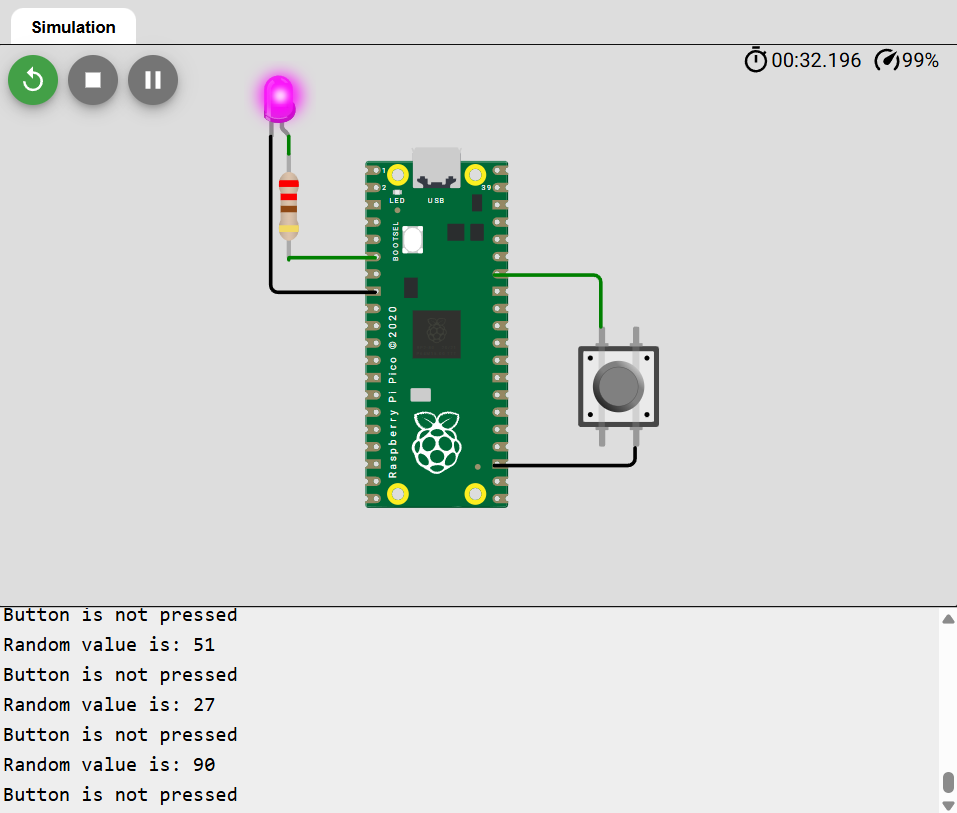

# Description
Basic Arduino project for Raspberry Pi Pico.
Turns ON LED on random value higher than threshold or if button is pressed.

# Credits
I used [Wokwi](https://wokwi.com/) to simulate the hardware.

# Example

